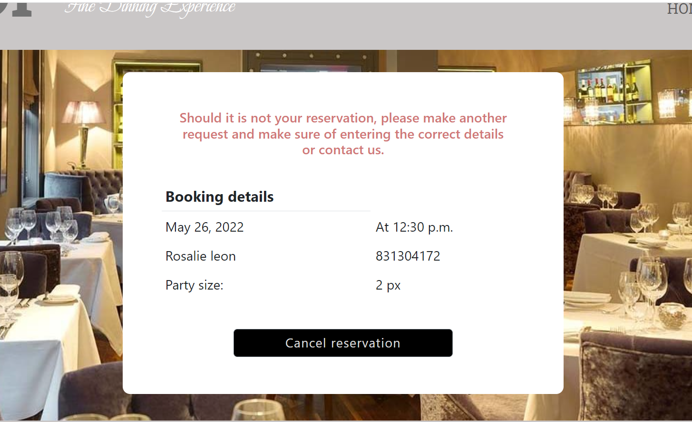

# Oryo Pocho Restaurant

This is a Restaurant site which provides valued information about the restaurant itself, and allows user make bookings easily whit a very intuitive navigation and a straightforward booking request form.

- Go to live [Orio Pocho](<https://en.wikipedia.org/wiki/Battleship_(game)>)

# Table of contents

###  [Planning stage](#planning-stage)

- Target audience
- User stories
- Wireframes
- Flow chart

### [Features](#features)

 - Make reservations
 - Search existings reservations
 - Cancel reservations
 - Reservation form validation
 - Send contact email to management
 - Maps

### [Future Features](#features)

### [Testing](#testing)

- Manual Testing
- Automated testing
- Light house
- Validators

### [Technology Used](#technology-used)

- Languages
- Libraries

### [Bugs](#bugs)

- Fixed bugs
- Unknown bugs

### [Credits](#credits)

- Content
- Acknowledgements

# Planning Stage

## Target audience

People interested in celebrating a special ocasion, wanting to make a reservation, as well as interested in knowing what the restaurant is about, cancel a reservation or contact the management venue.

## User Stories

- As an **User** I want to...
  
  - An intuitive navigation.
  - Access the site from any size screen.
  - See restaurant availability.
  - See restaurant contact details.
  - Check what the restaurant is about.
  - See images of the venue and food.
  - Be able of making reservations through the website.
  - Be able of canceling reservations through the website.
  - Send email to the management.

- As an **Admin** i can...

  - Get into reservations records so that I can easily manage data.
  - Filter and search all custom models from the admin page so that I can utilize the admin page to        review, edit and delete data quickly.
  - Easily navigate the admin panel so that I can view, search, add and delete records.

## Wireframes

I have not wireframed this project. I didn't want to spend any time in doing so tbh..
I'm a bit dessaster for planing proyects, i should start doing things properly and being more profesional.

## Flow Chart

## Features

- Make reservations

  - Users are able to make reservations through a straightforward interface

- Search existings reservations.
    
  - Users are able to search their reservations
  

- Cancel reservations.

  - Users can cancel their reservations.

  
- Reservation form validation

  - Form data is checked before submiting to ansure correct data is entered
  

- Send contact email to management

- Maps

  - As per the user to easily see venue's location without exiting the site

## Future features

  - **Reservations**
  Currently the reservations app can only take one table at a time, the posibility of joining tables and store them in database would make the app a real world and efficient application.

  - **Reviews**
  Could have a review section linked to tripadvisor or to open table from where potential customers could check people's opinions out easily from the website.

  - **Menus Examples**
  Menus examples could be displayed in a seperated pdf window from which interested users could print them out.

  - **User account**
  In case the company had some other venues, users could have a private account from which check and manage reservations from one single website and receive deals or news from them.

## Technology used

  - Languages used according to **Github** reports.

  

  - Libraries

    - Front-end:

    1.[JQuery](<https://jquery.com/>)
    2.[Animate.css](<https://animate.style/>)
    3.[Cloudinary](<https://cloudinary.com/>)
    - Back-end:
    1.[Summernote](<https://summernote.org/>)
    Still don't know what it is for...i have it installed for this proyect..i don't know why!

  - Frameworks

    1.[Boostrap](<https://getbootstrap.com/>)
    2.[Django](<https://www.djangoproject.com/>)

  