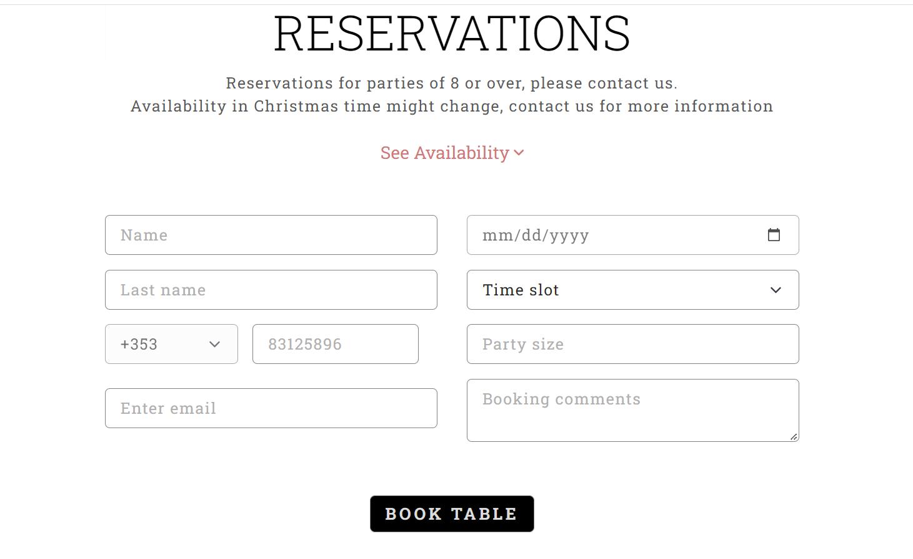
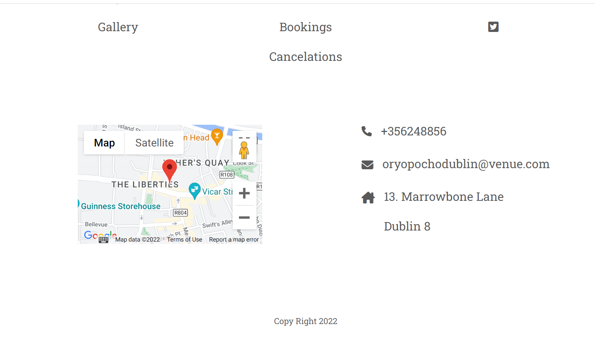
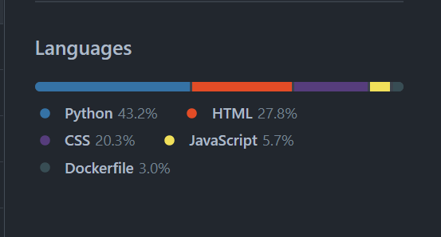

# Oryo Pocho Restaurant

This is a Restaurant site which provides valued information about the restaurant itself, and allows user make bookings easily whit a very intuitive navigation and a straightforward booking request form.

- Go to live [Orio Pocho](<https://en.wikipedia.org/wiki/Battleship_(game)>)

# Table of contents

###  [Planning stage](#planning-stage)

- Target audience
- User stories
- Design goals
- Design choises
- Font
- Color scheme
- Wireframes
- Flow chart

### [Features](#features)

 - Make reservations
 - Search existings reservations
 - Cancel reservations
 - Reservation form validation
 - Send contact email to management
 - Maps

### [Future Features](#features)

### [Testing](#testing)

- Manual Testing
- Automated testing
- Light house
- Validators

### [Technology Used](#technology-used)

- Languages
- Libraries

### [Bugs](#bugs)

- Fixed bugs
- Unknown bugs

### [Deployment](#deployment)

### [Credits](#credits)

- Content
- Acknowledgements

# Planning Stage

## Target audience

People interested in celebrating a special ocasion, wanting to make a reservation, as well as interested in knowing what the restaurant is about, cancel a reservation or contact the management venue.

## User Stories

- As an **User** I want to...
  
  - An intuitive navigation.
  - Access the site from any size screen.
  - See restaurant availability.
  - See restaurant contact details.
  - Check what the restaurant is about.
  - See images of the venue and food.
  - Be able of making reservations through the website.
  - Be able of canceling reservations through the website.
  - Send email to the management.

- As an **Admin** i can...

  - Get into reservations records so that I can easily manage data.
  - Filter and search all custom models from the admin page so that I can utilize the admin page to        review, edit and delete data quickly.
  - Easily navigate the admin panel so that I can view, search, add and delete records.

## Wireframes

I have not wireframed this project. I didn't want to spend any time in doing so tbh..
I'm a bit dessaster for planing proyects, i should start doing things properly and being more profesional.

## Flow Chart

## Features

- Make reservations

  - Users are able to make reservations through a straightforward interface

- Search existings reservations.
    
  - Users are able to search their reservations
  

- Cancel reservations.

  - Users can cancel their reservations.

  
- Reservation form validation

  - Form data is checked before submiting to ansure correct data is entered
  

- Send contact email to management

- Maps

  - As per the user to easily see venue's location without exiting the site

## Future features

  - **Reservations**
  Currently the reservations app can only take one table at a time, the posibility of joining tables and store them in database would make the app a real world and efficient application.

  - **Reviews**
  Could have a review section linked to tripadvisor or to open table from where potential customers could check people's opinions out easily from the website.

  - **Menus Examples**
  Menus examples could be displayed in a seperated pdf window from which interested users could print them out.

  - **User account**
  In case the company had some other venues, users could have a private account from which check and manage reservations from one single website and receive deals or news from them.

## Technology used

  - Languages used according to **Github** reports.

  

  - Libraries

    - Front-end:

    1.[JQuery](<https://jquery.com/>)
    2.[Animate.css](<https://animate.style/>)
    3.[Cloudinary](<https://cloudinary.com/>)
    4.[Fontawsome](<https://fontawesome.com/>)
    5.[Google Fonts](<https://fonts.google.com/>)

    - Back-end:

    1.[Summernote](<https://summernote.org/>)
    Still don't know what it is for...i have it installed for this proyect..i don't know why!

  - Frameworks

    1.[Boostrap](<https://getbootstrap.com/>)
    2.[Django](<https://www.djangoproject.com/>)
    3.All packages installed canbe fond in requirements.txt file

## Bugs

- Fixed bugs

I have come accross multiple bugs and didn't write them down...i'm a bit of a disaster..i gotta learn to organize work as i go

- Unfixed bugs

Currently from the cancelations page, the link back to home page does no work..

## Deployment

The project was deployed to Heroku using the below procedure:-

- Log in to Heroku or create an account if required.
- Click the button labeled New from the dashboard in the top right corner, just below the header.
- From the drop-down menu select "Create new app".
- Enter a unique app name.
- Once the web portal shows the green tick to confirm the name is original select the relevant region. In my case, I chose Europe as I am in Ireland.

- When happy with your choice of name and that the correct region is selected, click on the "Create app" button.
- Go to tap "Resources" and add a new add-on "Heroku Postgres"
- Copy the database url.
- This will bring you to the project "Deploy" tab. From here, navigate to the settings tab and scroll down to the "Config Vars" section.
- And paste it in value field of "Reveal Config Vars"
- Click the button labelled "Reveal Config Vars" and enter the "keys" and  "values"you need, and click the "add" button.
- Scroll down to the buildpacks section of the settings page and click the button labeled " add buildpack," select "Python," and click "Save Changes".
- Scroll back to the top of the settings page, and navigate to the "Deploy" tab.
- From the deploy tab select Github as the deployment method.
- Confirm you want to connect to GitHub.
- Search for the repository name and click the connect button next to the intended repository.
- From the bottom of the deploy page select your preferred deployment type by follow one of the below steps:
- Clicking either "Enable Automatic Deploys" for automatic deployment when you push updates to Github.
- Select the correct branch for deployment from the drop-down menu and click the "Deploy Branch" button for manual deployment.

### Heroku update

- A number of user login tokens for Heroku had been compromised in a security attack. In response, Heroku have removed this particular login functionality from their site. It is currently unclear when or if they well re-enable it. This means that you will no longer be able to deploy apps from the Heroku dashboard, nor will apps automatically update/redeploy in future. All future deployments will have to be done manually from the terminal.

- **IF YOU ARE CREATING A NEW DEPLOYMENT/APP**

Run the command *heroku login -i* and login when prompted. Then run the command *heroku create your_app_name_here* to create a new app, replacing *your_app_name_here* with the name you want to give your app. This will create a new Heroku app and link it to your Gitpod terminal. You can then access the app via the Heroku dashboard and set up your config vars.

- **IF YOU ALREADY HAVE AN APP CREATED WHICH USES AUTOMATIC DEPLOYS**

Run the command *heroku login -i* and login when prompted. Then run the following command: *heroku git:remote -a your_app_name_here* and replace *your_app_name_here* with the name of your Heroku app. This will link the app to your Gitpod terminal.

Once you have followed the appropriate step above, your Heroku app will be linked to your Gitpod workspace.

- **HOW TO DEPLOY**
  
By running the command git push heroku main and your app will be deployed to Heroku.